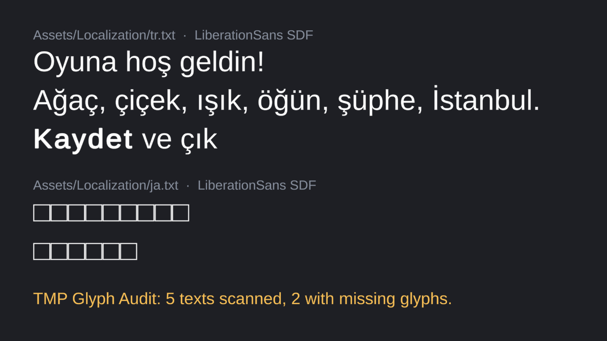

# TMP Glyph Audit

[](https://github.com/RizgarOzan/tmp-glyph-audit/actions/workflows/tests.yml)

Find every TextMeshPro text your fonts **cannot draw** — before a player sees the
empty boxes.

TextMeshPro only tells you a character is missing when that exact text is rendered, one
warning at a time, at runtime. That is how a Turkish `ğ`, a Polish `ł` or a Japanese menu
ships as `□□□`. This package checks the whole project at once, in the editor or in CI:

- every `TMP_Text` in your **scenes** and **prefabs**,
- **runtime-only text** — localization exports, dialogue files — against the font that
  will display it,
- through the **same fallback chain TMP uses**: the font, its fallback list (depth
  first), the global fallbacks in TMP Settings, then the TMP Settings default font.
  Dynamic font assets count a character as available when their source font file has it,
  because TMP adds it to the atlas at runtime.

It never modifies a font asset or its atlas.



*The two sample files in this repository's test project, drawn by TextMeshPro with
LiberationSans SDF and its fallback (Unity 6000.3, batch mode), with the audit's summary
under them. The full report names each missing character and, per line, the ones it needs:*

```
TMP Glyph Audit: 5 texts scanned, 2 with missing glyphs.

Assets/TextMesh Pro/Resources/Fonts & Materials/LiberationSans SDF.asset is missing 15: U+3046 'う', U+3053 'こ', …
  Assets/Localization/ja.txt > line 1: うこそへよゲムー！
  Assets/Localization/ja.txt > line 2: して了保存終
```

`unity/Assets/Editor/ReadmeImage.cs` renders the image (the command is in its header comment).

## Install

Unity 2023.2 or newer (TextMeshPro inside `com.unity.ugui` 2.0). In **Package Manager →
+ → Add package from git URL**:

```
https://github.com/RizgarOzan/tmp-glyph-audit.git?path=/packages/com.rizgarozan.tmp-glyph-audit
```

## Use

**Window → Text → TMP Glyph Audit.** Choose folders, tick scenes / prefabs, add runtime
text files (folder + pattern + the TMP font that shows them) and press **Scan**. For each
font you get the missing characters and every text that needs them; **Ping** selects the
asset, **Export characters…** writes the missing set to a `.txt` you can feed to the Font
Asset Creator (*Character Set → Characters from File*) to build a fallback atlas.

Settings are saved to `ProjectSettings/TmpGlyphAuditSettings.json`, so the team and CI
share them.

**CI:** run the same scan in batch mode. Exit code `0` = every character can be drawn,
`1` = glyphs are missing, `2` = the scan itself failed.

```bash
Unity -batchmode -nographics -projectPath . \
  -executeMethod RizgarOzan.TmpGlyphAudit.Editor.GlyphAuditCli.Run \
  -glyphAuditReport Logs/tmp-glyph-audit.txt
```

## Why not …

- **TMP's own warning** ("The character with Unicode value … was not found in the [font]
  font asset or any potential fallbacks") is logged only when that text is rendered, so it
  covers the screens someone opened, in the language they played. The audit reads every
  text without running the game.
- **`TMP_FontAsset.HasCharacters`** checks a string you already have. Finding every string
  in scenes, prefabs and data files, and leaving out rich-text tags, is the work this
  package does.
- **The Font Asset Creator's missing-character report** lists characters of the set you
  typed that the source font file lacks. It doesn't know which characters your texts use,
  or that a fallback font already covers them.
- **Ready-made character lists** per language are good input for building an atlas. They
  tell you what a language may use, not what your project's text uses today.

## What counts as "needs a glyph"

The scanner reads text the way TMP's parser does: rich-text tags (`<b>`, `<color=#F00>`,
`<sprite=3>`, …) are not drawn, `<noparse>` content is drawn literally, `\u011F`-style
escapes draw the character they name, surrogate pairs are one character, and control,
zero-width and bidi characters are skipped. Unknown tags such as `<madeup>` are drawn
literally — TMP does the same.

`<font="Name">` switches font mid-text, so the text up to `</font>` is checked against
that font's chain and reported under that font. The name is looked up in
`Resources/<TMP Settings font path>` (`Fonts & Materials/` by default), then among all TMP
font assets in the project, since TMP also finds fonts other texts have already loaded.
A tag naming a font that exists nowhere is drawn as text, as TMP draws it.

## Limits

- **Unity Localization string tables** are not read yet — export them to text or help add
  it ([#9](https://github.com/RizgarOzan/tmp-glyph-audit/issues/9)).
- `DynamicOS` font assets are checked against the fonts installed on the machine running the
  audit, which may differ from your players'.

## Develop

The rules (text scanning, fallback resolution, the report) are plain C# with no Unity
reference, compiled both into the package and into a .NET project:

```bash
dotnet test tests/TmpGlyphAudit.Core.Tests      # 24 tests, no Unity needed
```

The Unity side is tested in `unity/` (Unity 6000.3, TMP Essential Resources imported):

```bash
unity test unity --mode EditMode                 # 5 tests, uses a generated test font
```

`tools/make_test_font.py` builds the tiny font the Unity tests use (fontTools), so the repo
carries no third-party font of its own.

Want to help? Issues labelled [`good first issue`](https://github.com/RizgarOzan/tmp-glyph-audit/labels/good%20first%20issue)
say what to change and how the result is checked; several need only the .NET SDK, not Unity.
See [CONTRIBUTING.md](CONTRIBUTING.md) for the layout and the checks a pull request needs.

## License

MIT — see [LICENSE](LICENSE). TMP Essential Resources inside `unity/` belong to Unity and
come with its TextMeshPro package.
